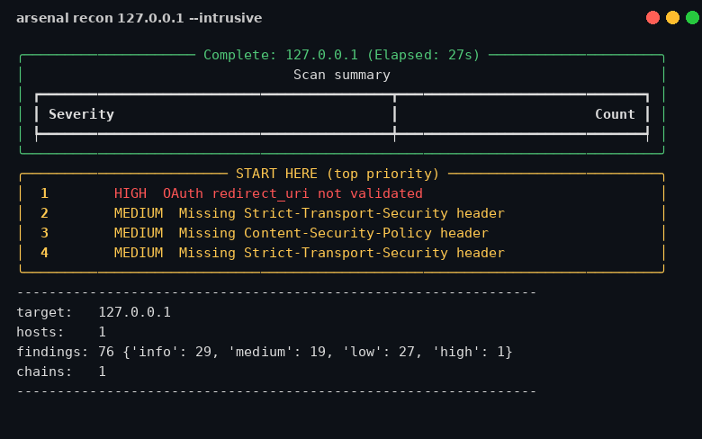
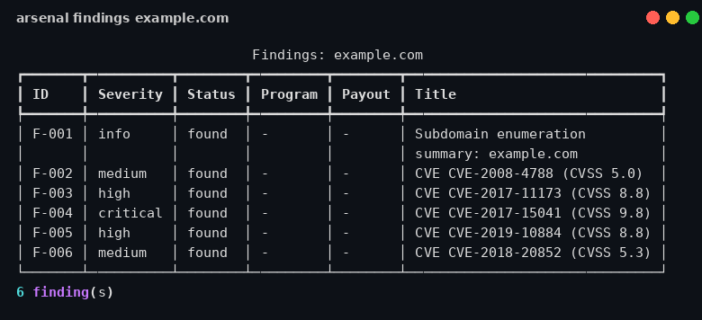
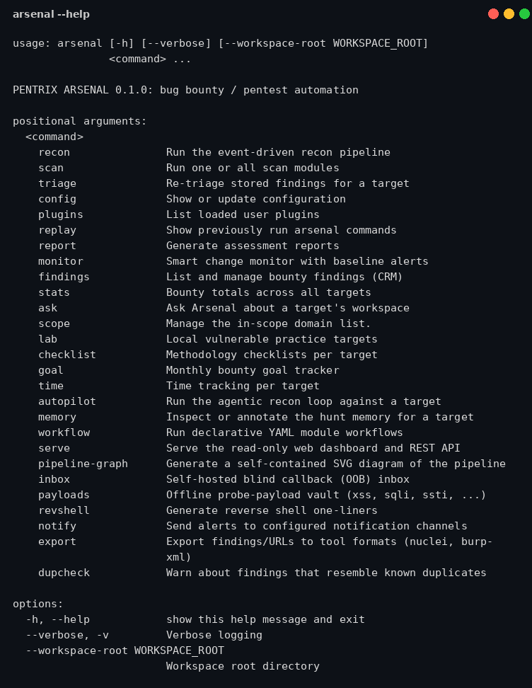

# PENTRIX ARSENAL

**The all-in-one bug bounty and pentest automation framework.**

[](LICENSE)
[](https://www.python.org/)
[](#modules)
[](#)

Arsenal unifies reconnaissance, vulnerability scanning, JavaScript intelligence,
AI-assisted triage, bounty workflow tracking, and professional reporting into
one command-line framework with a live terminal dashboard. It is built for
authorized bug bounty hunting and penetration testing: every intrusive check
is gated behind explicit flags, out-of-scope targets are hard-blocked, and a
passive-only mode guarantees zero packets to the target.

> **Ethical use:** Arsenal is for systems you are authorized to test: your own
> assets, bug bounty programs within their defined scope, contracted
> engagements, and local lab targets (`arsenal lab`). Do not point it at
> systems without permission. You are responsible for complying with the law
> and with each program's rules of engagement.

## Screenshots

Live terminal dashboard during an intrusive recon run:



The bounty CRM finding tracker:



Every command at a glance:



## Quick start

```bash
git clone https://github.com/mizazhaider-ceh/pentrix-arsenal
cd pentrix-arsenal
python3 -m venv .venv && .venv/bin/pip install -r requirements.txt

# Passive recon first: zero packets to the target, OSINT sources only
.venv/bin/python -m arsenal recon example.com --passive

# Full pipeline with live dashboard (intrusive checks need the flag)
.venv/bin/python -m arsenal recon example.com --intrusive

# One-command HTML report, ready to attach to a bounty submission
.venv/bin/python -m arsenal report example.com
```

Or install it as a proper command:

```bash
.venv/bin/pip install -e .
arsenal recon example.com --passive
```

Practice safely first: `arsenal lab up` spins up ten vulnerable fixtures on
127.0.0.1 (XSS, SQLi, SSTI, open redirect, CORS, GraphQL, JWT, OAuth, JS
secrets, header issues) so every module can be exercised legally.

## What it does

**Recon pipeline** (`arsenal recon <target>`) — event-driven, not linear.
Discoveries feed back into the queue automatically: a new subdomain triggers
an alive check, then a port scan, then service-aware enumeration, then
technology-specific checks. Findings include subdomains (certificate
transparency, CertSpotter, HackerTarget), alive hosts, open ports with
banners, technology fingerprints (headers, JS libraries, favicon hash,
WAF/CDN detection), and subdomain takeover checks via DNS-over-HTTPS.

**Web vulnerability modules** — security headers, reflected XSS with context
classification, error-based SQLi with DBMS identification, JWT analysis
(none algorithm, weak secrets, jku/x5u, injectable kid), CORS
misconfiguration, open redirects, tech-aware smart fuzzing, hidden parameter
discovery, GraphQL introspection, OAuth redirect_uri validation, SSTI,
prototype pollution, cache poisoning, and host header injection.

**JavaScript intelligence engine** (`jsintel`) — crawls same-host JavaScript,
extracts hidden API endpoints and parameters, then probes the endpoints:
unauthenticated access, verbose error leaks, and exposed debug/admin paths.
A companion secrets extractor scans JS (and historic JS from the Wayback
Machine) for leaked keys and tokens.

**Auto-verify** — safe vulnerability classes get exploitability proof, not
just detection. Open redirects are verified by walking the redirect chain,
CORS by replaying the evil Origin, GraphQL by parsing the returned schema.
Every finding carries a confidence level: **proven**, **strong** (strong
evidence), or **review** (needs manual review).

**AI triage analyst** — every finding gets an exploitability verdict
(exploitable / needs manual review / likely false positive), tailored next
steps, and a draft bounty report section (title, impact, reproduction
steps). Pluggable OpenAI-compatible provider via `ARSENAL_LLM_API_KEY`;
without a key, a solid rule-based triage runs instead, so the tool works
out of the box.

**Attack surface graph** — every HTML report embeds an interactive visual
graph: domains to IPs to ports to technologies to findings. The graph
renderer is vendored locally; reports work fully offline.

**Chain suggester** — a rule engine connects findings into ranked exploit
chain hypotheses (open redirect + OAuth = account takeover, XSS + admin
panel = session theft path, and more), each with plain-language reasoning
and concrete next steps.

**Smart monitoring** (`arsenal monitor <target>`) — alerts fire on meaning,
not just diffs: a new subdomain serving a login page, a newly opened port,
a tech stack change on a sensitive endpoint, changed JavaScript, newly
exposed `/.git/HEAD` or `/.env`, and visual page changes.

**Bounty CRM** (`arsenal findings`, `arsenal stats`) — every finding moves
through found, triaged, reported, accepted / duplicate / informative, paid.
Track payouts per program and per vulnerability class, plus hours hunted.

**Hunt aids** — priority scoring ("start here" ordering by bug likelihood),
`arsenal ask` (answers from your workspace data), methodology checklists,
goal and time tracking, session replay, YAML workflows, an agentic
autopilot loop with persistent hunt memory, a read-only REST API + web UI,
an offline payload vault, a reverse shell generator, a blind-callback inbox
for out-of-band testing, nuclei/Burp exporters, duplicate prediction across
programs, and a plugin system (drop a Python file in `~/.arsenal/plugins/`).

**Safety rails** — safe mode is the default (intrusive modules need
`--intrusive`), the scope firewall hard-blocks out-of-scope targets even on
typos, `--passive` guarantees no active scanning, and stealth mode adds
rate limits, jitter, and rotating user agents.

## Modules

| Module | What it does |
|---|---|
| `recon` | Subdomain enum (CT, CertSpotter, HackerTarget) + alive check + takeover detection |
| `portscan` | Async TCP scan, top ports, banner grabbing |
| `tech` | Fingerprinting: headers, JS libs, favicon hash, WAF/CDN |
| `jssecrets` | Secret extraction from JavaScript files |
| `jsintel` | Hidden API endpoint/parameter discovery + unauthenticated probing |
| `headers` | Security header analysis with grading |
| `xss` | Reflected XSS with reflection-context classification |
| `sqli` | Error-based SQLi with DBMS identification |
| `jwt` | JWT weakness analysis (none alg, weak secrets, jku/x5u, kid) |
| `cors` | CORS misconfiguration detection |
| `redirect` | Open redirect detection |
| `fuzz` | Tech-aware smart fuzzing |
| `paramminer` | Hidden parameter discovery |
| `graphql` | GraphQL introspection testing |
| `oauth` | OAuth redirect_uri and implicit-flow tests |
| `ssti` | Server-side template injection detection |
| `ppollution` | Prototype pollution probing |
| `cachepoison` | Cache poisoning checks |
| `hostheader` | Host header injection tests |
| `wordlist` | Target-specific wordlist generation |
| `hashid` | Hash type identification |
| `phish` | Phishing URL heuristic analysis |
| `secrets` | Local secret scanning (files and directories) |
| `cve` | NVD CVE search with CVSS mapping |

Run one: `arsenal scan <target> --module xss --intrusive`. Run all applicable:
`arsenal scan <target> --all --intrusive`.

## Command reference

```
arsenal recon <target> [--passive] [--intrusive] [--resume] [--scope-file F]
arsenal scan <target> --module NAME | --all [--intrusive] [--passive]
arsenal report <target> [--format html|yeswehack|hackerone]
arsenal monitor <target>
arsenal triage <target>
arsenal ask <target> "what should I test next?"
arsenal findings <target> [--status S] [--set F-001 --to reported --program P --payout N]
arsenal stats [--program P]
arsenal scope <target> --import scope.txt | --show
arsenal checklist <target> [class] [--tick N]
arsenal lab up|list
arsenal autopilot <target> [--max-cycles N] [--intrusive] [--passive]
arsenal memory <target> [--add "note"] [--search QUERY]
arsenal workflow run flow.yaml [--target T]
arsenal serve [--port 8080]
arsenal pipeline-graph [--out dag.html]
arsenal payloads --list [--class xss] [--search Q]
arsenal revshell --lhost X --lport Y [--lang python]
arsenal inbox [--port 8888] [--check]
arsenal notify --test
arsenal export <target> --format nuclei|burp-xml
arsenal dupcheck <target>
arsenal goal [show|set <amount>|progress]
arsenal time [report|log <target> <hours>]
arsenal plugins
arsenal replay [--list|--last N]
arsenal config [--show] [--set key=value]
```

## Workspaces

Every target gets a workspace under `~/.arsenal/workspaces/<target>/`:
scan artifacts per module, the aggregate `findings.json` (searchable via
`arsenal findings` and the Python API), monitor baselines and diffs, hunt
memory, checklists, the generated `report.html`, and fetched JavaScript.

## Configuration

`arsenal config --show` prints the effective config (`~/.arsenal/config.json`):
scan profiles (default/aggressive), timeouts, safe mode, stealth mode,
notification webhooks, and the LLM provider (base URL and model; the API key
itself only ever comes from the `ARSENAL_LLM_API_KEY` environment variable).

## Architecture

```
arsenal/
  cli.py            argparse front end, safety guardrails, session logging
  pipeline.py       event-driven recon engine (discoveries feed new scans)
  dashboard.py      rich live TUI
  modules/          24 scan modules, one contract: run(target, ctx)
  http.py           shared HTTP client (stealth, UA rotation, timeouts)
  findings.py       finding schema (severity + proven/strong/review)
  workspace.py      per-target storage, search
  verify.py         auto-verify engine (confidence promotion)
  triage.py / llm.py  AI triage analyst (LLM or rule-based fallback)
  ask.py            workspace-grounded Q&A
  report.py         HTML / YesWeHack / HackerOne reports + attack graph
  monitor.py        smart change monitoring + alerts
  visual.py         structural page thumbnails, similarity clustering
  chains.py         exploit-chain hypotheses
  crm.py            finding lifecycle + payouts
  scope.py          scope import, coverage, firewall
  priority.py       hunt priority scoring
  wayback.py        Wayback Machine CDX client
  cvss.py           CVSS 3.1 calculator
  autopilot.py      agentic hunt loop + hunt memory
  workflows.py      declarative YAML pipelines
  serve.py          read-only REST API + web dashboard
  lab.py            local vulnerable fixtures for practice
  plugins.py        user plugin loader
  ...plus inbox, payloads, revshell, notify, exporters, dupcheck,
      checklists, goals, session, memory, pipeviz
```

The ten original `pentrix-*` tools live on as credited first-class modules:
their detection logic was adapted into this framework (see each module's
docstring).

## Roadmap

70 ideas are tracked in [ROADMAP.md](ROADMAP.md): what shipped in this
release and what is planned next, including inspiration credits for ideas
distilled from the community's best bounty tooling.

## License

MIT. See [LICENSE](LICENSE).
