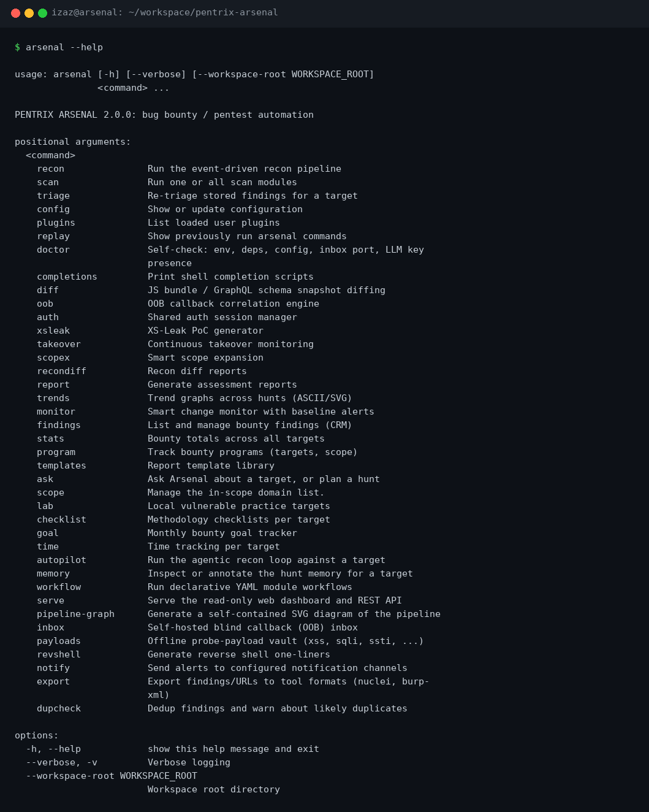
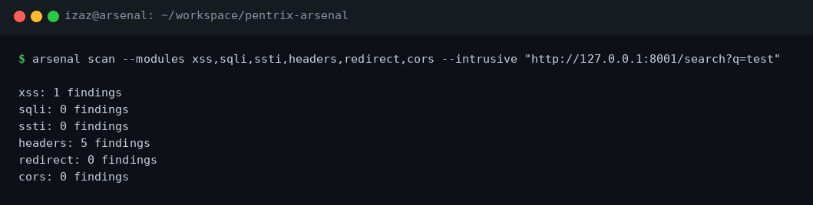
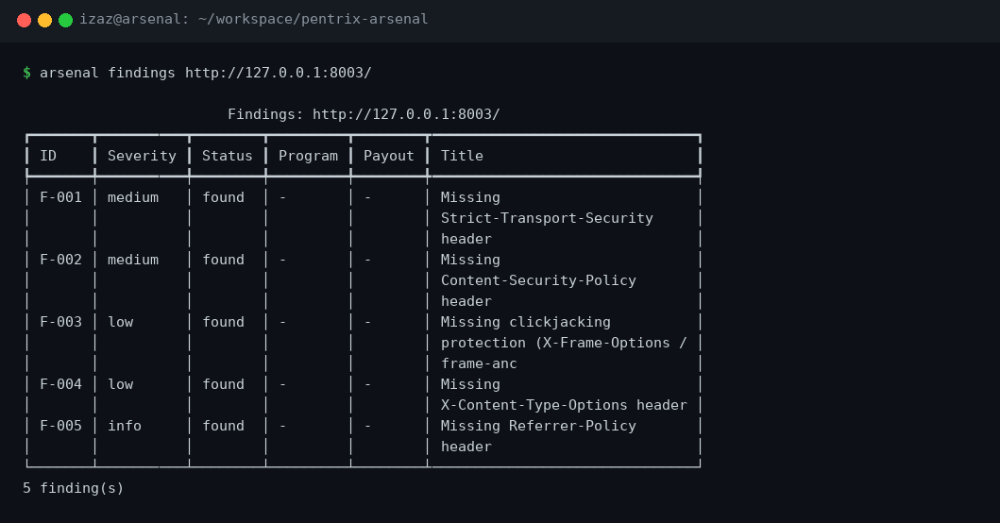
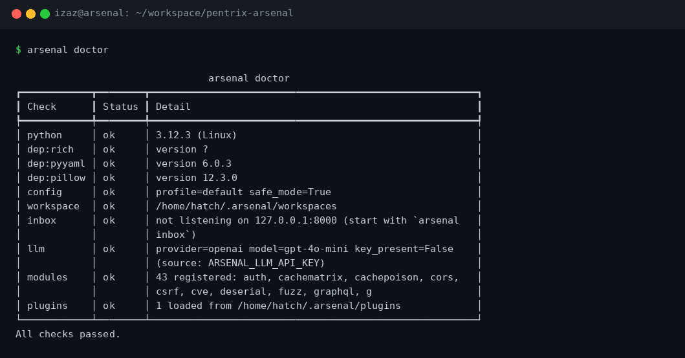
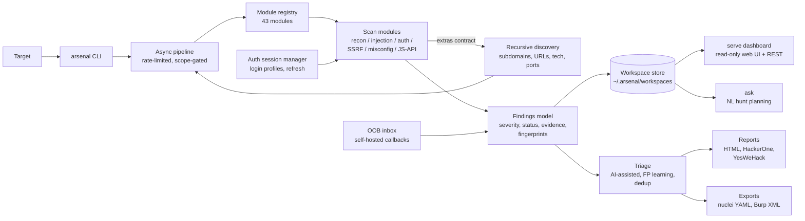

# PENTRIX ARSENAL

**The all-in-one bug bounty and pentest automation framework.**

[](pyproject.toml)
[](https://www.python.org/)
[](LICENSE)
[](#module-catalog)
[](tests/)

Most scanners do one thing: recon, or payloads, or reports. Arsenal is the
whole hunt in one CLI. 43 scan modules, an event-driven recon pipeline that
remembers what it found, a self-hosted out-of-band callback inbox, an auth
session manager shared across modules, AI-assisted triage that learns from
your false-positive marks, bounty CRM with payout tracking, and reports that
export to HTML, HackerOne, YesWeHack, nuclei YAML, and Burp XML. Everything
runs locally, everything is scriptable, and nothing phones home.

```bash
git clone https://github.com/mizazhaider-ceh/pentrix-arsenal
cd pentrix-arsenal
python3 -m venv .venv && source .venv/bin/activate
pip install -e .
arsenal --help
```

First scan in 60 seconds, against the built-in vulnerable lab (no external
target needed):

```bash
arsenal lab up   # 16 vulnerable fixtures on 127.0.0.1:8001-8016 (runs in foreground)

# second terminal:
arsenal scan --modules xss,sqli,ssti,headers,redirect,cors --intrusive \
  "http://127.0.0.1:8001/search?q=test"
arsenal findings "http://127.0.0.1:8001/search?q=test"
```



---

## Screenshots

Real runs, captured from the terminal. No mockups.

**Multi-module scan against a lab fixture:**



**Findings table (the CRM view):**



**`arsenal doctor` self-check:**



---

## Why Arsenal

I read the source of the tools everyone uses and wrote down exactly where
each one stops. Full working paper: `docs/RESEARCH.md`.

| Capability | nuclei | BBOT | Osmedeus | ZAP | Burp Suite | Caido | **Arsenal v2** |
|---|---|---|---|---|---|---|---|
| WAF-adaptive payload mutation | no | no | no | no | no | no | engine (provider API) |
| JS bundle / GraphQL schema diffing across runs | no | no | no | no | no | no | yes |
| Auth sessions with token refresh, shared across scans | no | no | no | partial | partial | partial | yes |
| OOB testing with callback correlation | partial | no | no | no | yes (Pro) | no | yes (self-hosted) |
| Business-logic flaw workflow packs | no | no | no | no | no | no | yes |
| Cache deception / poisoning matrix | no | no | no | no | partial | no | yes |
| FP learning from analyst feedback | no | no | no | no | no | no | yes |
| HTTP/3 + gRPC recon | no | no | no | no | partial | no | yes |
| Smart scope expansion (ASN, CT org pivoting) | no | partial | no | no | no | no | yes |
| Continuous takeover monitoring with diffs | no | no | partial | no | no | no | yes |
| XS-Leaks PoC generation | no | no | no | no | no | no | yes |
| Parallel race-condition testing | no | no | no | no | no | no | yes |
| Cross-tool finding dedup | no | no | no | no | no | no | yes |
| Recursive recon (findings feed new targets) | no | yes | no | no | no | no | yes |
| Free, full API + automation | yes | yes | yes | yes | no ($449/yr) | partial | yes |

The structural problems this table comes from:

- **nuclei** is stateless by design, with primitive auth. Great template
  library, zero memory between runs.
- **BBOT** is recon-only. It finds attack surface and stops there.
- **Osmedeus** is an orchestrator with no built-in capability of its own.
- **ZAP** findings are noisy and there is no learning loop.
- **Burp Suite** is $449/year, Community is deliberately crippled, and
  there is no real collaboration story.
- **Caido** is a solid proxy but has no race-condition testing and no
  hunt-level automation.
- The recon stack (subfinder/httpx/katana) has no shared data model and
  no memory between runs. dalfox, sqlmap and ffuf are best-in-class at
  what they do but know nothing about your target or your session.
  interactsh correlation is manual. Agentic AI tools burn tokens on real
  targets with no persistent recon memory.

### Honest limits

A comparison table with no "we can't do this" column is marketing. Here
is what Arsenal genuinely cannot do, from the same research:

- **True DOM XSS.** Needs a headless browser. Not shipped, not claimed.
- **Subfinder-grade passive recon.** Needs paid API keys. Arsenal does
  crt.sh, CertSpotter, hackertarget and AlienVault, which is good but not
  that.
- **Private Collaborator-grade OOB.** Needs owned DNS infrastructure.
  Arsenal ships a self-hosted HTTP inbox, which covers blind SSRF/XXE
  confirmation on labs and owned infra, not internet-scale callbacks.
- **WAF bypass at scale.** Needs IP diversity. The mutation engine is
  honest single-target testing: a burned source IP stays burned.
- **LLM features at volume.** Needs an inference budget. AI triage works
  with your own key (`ARSENAL_LLM_API_KEY`) and degrades gracefully to
  rules without one.

---

## Architecture



How the pieces fit:

- **Pipeline** (`arsenal/pipeline.py`): async, rate-limited, scope-gated.
  It picks modules by target kind (URL, domain, IP, token, hash, keyword,
  path), so a JWT module never tries to parse a domain string as a token.
  Intrusive modules are gated on `--intrusive` and read each module's own
  `INTRUSIVE` declaration as the single source of truth.
- **Modules** (`arsenal/modules/`): 43 of them, registered in one
  `REGISTRY`. Each declares `TARGET_KIND`, `INTRUSIVE`, and a
  `run(target, ctx)` that returns findings plus an extras dict
  (`subdomains`, `alive`, `open_ports`, `urls`, `tech`). The extras feed
  recursive discovery directly: a recon module finds subdomains, the
  pipeline queues them, tech fingerprinting picks follow-up modules.
- **Findings model** (`arsenal/findings.py`): every finding carries
  module, severity, title, evidence, and a fingerprint
  (kind+host+param+evidence hash) used by dedup.
- **Triage** (`arsenal/triage.py`): re-scores findings, collapses
  duplicates, and learns. `arsenal triage --mark-fp F-003` records a
  false positive with your note, and future triage runs weigh it.
- **Reporting** (`arsenal/report.py`, `arsenal/exporters.py`): full HTML
  reports, HackerOne/YesWeHack submission formats, runnable nuclei YAML
  for high/critical strong-confidence findings (never TODO skeletons),
  and Burp site-map XML.
- **Workspace** (`~/.arsenal/workspaces`): per-target memory. Findings,
  scope, notes, takeover state, and recon snapshots live here, so runs
  months apart still share context.

---

## Module catalog

All 43 modules, each with a real command (tested) and real sample output
from the lab fixtures. Lab not running? `arsenal lab up` first.

### Recon

**`recon`** (domain, safe): Passive subdomain enumeration via crt.sh,
CertSpotter, hackertarget and AlienVault, with HTTP alive checks and
subdomain-takeover triage.
```bash
arsenal recon example.com --passive
# passive-only: recon + cve modules, zero packets beyond public APIs
```

**`tech`** (url, safe): Technology fingerprinting from headers, HTML
markers and favicon hash. Feeds the pipeline's module selection.
```bash
arsenal scan --module tech http://127.0.0.1:8011/
# tech: 6 findings
#   -> "Technology: Express"
#   -> "WAF/CDN detected: AWS CloudFront / ELB"
```

**`portscan`** (ip, safe): Async TCP port scan over common ports with
banner grabbing.
```bash
arsenal scan --module portscan 127.0.0.1
# portscan: 10 findings   (open lab ports with banners)
```

**`http3`** (host, safe): HTTP/3 + QUIC surface discovery: Alt-Svc
header parsing and UDP/443 QUIC probing.
```bash
arsenal scan --module http3 127.0.0.1
# http3: 1 findings
#   -> "No HTTP/3 surface detected on 127.0.0.1"
```

**`grpc`** (host, safe): gRPC recon: reflection-based service/method
enumeration and per-method probes.
```bash
arsenal scan --module grpc 127.0.0.1
# grpc: 2 findings
#   -> "No gRPC reflection endpoint on 127.0.0.1:443"
#   -> "No gRPC reflection endpoint on 127.0.0.1:50051"
```

**`wordlist`** (url, safe): Builds a targeted password wordlist from
words found on the target site, with year, suffix and leet mutations.
For authorized testing.
```bash
arsenal scan --module wordlist http://127.0.0.1:8011/
# wordlist: 1 findings
#   -> "Targeted wordlist generated from site content"  (14 entries)
```

### Injection

**`xss`** (url, intrusive): Reflected XSS via inert canary payloads,
with reflection context classification (script, attribute, tag, text).
```bash
arsenal scan --module xss --intrusive "http://127.0.0.1:8001/search?q=test"
# xss: 1 findings
#   -> "Reflected XSS in parameter 'q'"
```

**`sqli`** (url, intrusive): Error-based SQL injection: break-out
payloads matched against DBMS error signatures.
```bash
arsenal scan --module sqli --intrusive "http://127.0.0.1:8002/item?id=1"
# sqli: 1 findings
#   -> "SQL injection in parameter 'id' (likely DBMS: MySQL)"
```

**`sqli_blind`** (url, intrusive): Boolean-based blind SQLi via
response differentials, with DBMS-specific payload sets.
```bash
arsenal scan --module sqli_blind --intrusive "http://127.0.0.1:8002/item?id=1"
# sqli_blind: 1 findings
#   -> "Boolean-blind SQLi in id (string/double-quote)"
```

**`ssti`** (url, intrusive): Server-side template injection across
parameters and path, watching for evaluated output.
```bash
arsenal scan --module ssti --intrusive "http://127.0.0.1:8007/hello?name=test"
# ssti: 1 findings
#   -> "Server-side template injection likely (parameter 'name')"
```

**`ssti_adv`** (url, safe): Deeper SSTI coverage across more engines
(Ruby `#{}`, Java `${}`, .NET `@{}` and friends), engine identification.
```bash
arsenal scan --module ssti_adv "http://127.0.0.1:8007/hello?name=test"
# ssti_adv: 1 findings
#   -> "SSTI: template evaluated {{7*7}} (Jinja2/Twig engine)"
```

**`ldap`** (url, safe): LDAP injection via error-based and boolean
differentials.
```bash
arsenal scan --module ldap "http://127.0.0.1:8001/search?q=test"
# ldap: 1 findings
#   -> "Possible blind LDAP injection via q"
```

**`xpath`** (url, safe): XPath injection via error-based and boolean
differentials.
```bash
arsenal scan --module xpath "http://127.0.0.1:8001/search?q=test"
# xpath: 1 findings
#   -> "Possible blind XPath injection via q"
```

**`xxe`** (url, safe): XML external entity injection: classic,
error-based, and blind variants with OOB confirmation via the inbox.
```bash
arsenal scan --module xxe "http://127.0.0.1:8001/"
# xxe: 1 findings
#   -> "Blind XXE needs OOB confirmation"
# (start `arsenal inbox`, then re-run with the callback base configured)
```

**`lfi`** (url, safe): Local file inclusion and path traversal probes;
RFI variants go through the OOB inbox when a callback base is configured.
```bash
arsenal scan --module lfi "http://127.0.0.1:8001/search?q=test"
# lfi: 1 findings
#   -> "RFI not tested: no blind callback base configured"
```

**`deserial`** (url, safe): Fingerprints serialized objects (Java, PHP,
Python pickle, .NET ViewState) in parameters, cookies and bodies.
```bash
arsenal scan --module deserial "http://127.0.0.1:8001/"
# deserial: 0 findings
```

**`ppollution`** (url, intrusive): Client/server prototype pollution:
injects `__proto__` and `constructor[prototype]` keys, checks for echo.
```bash
arsenal scan --module ppollution --intrusive "http://127.0.0.1:8001/search?q=test"
# ppollution: 0 findings
```

**`fuzz`** (url, intrusive): Technology-aware parameter fuzzing. Picks
canary payloads from the detected stack (`tech` hint) and flags anomalous
responses versus baseline.
```bash
arsenal scan --module fuzz --intrusive "http://127.0.0.1:8012/probe?x=1"
# fuzz: 1 findings
#   -> "Anomalous parameter behavior: 'x'"
```

**`paramminer`** (url, intrusive): Hidden parameter discovery: appends
common parameter names with a canary value, flags ones that change the
response.
```bash
arsenal scan --module paramminer --intrusive "http://127.0.0.1:8013/page"
# paramminer: 1 findings
#   -> "Hidden parameter discovered: 'debug'"
```

### Auth and session

**`auth`** (url, safe): Session cookie flags and entropy,
brute-force throttling checks, session fixation test steps.
```bash
arsenal scan --module auth "http://127.0.0.1:8001/"
# auth: 1 findings
#   -> "Session fixation: manual test steps"
```

**`jwt`** (token, safe): Decodes JWTs and reports alg=none, weak HMAC
secrets, weak algorithms, exp problems, untrusted jku/x5u, suspicious kid.
```bash
arsenal scan --module jwt "eyJhbGciOiJub25lIiwidHlwIjoiSldUIn0.eyJzdWIiOiJsYWItdXNlciIsInJvbGUiOiJ1c2VyIiwiaWF0IjowfQ."
# jwt: 4 findings
#   -> "JWT weakness: alg=none accepted"            (high)
#   -> "JWT weakness: weak HMAC secret"            (high)
#   -> "JWT weakness: weak/legacy algorithm"       (medium)
#   -> "JWT weakness: missing exp claim"           (low)
```

**`jwt_adv`** (token, safe): Deeper JWT checks: RS256 to HS256 confusion
guidance, kid traversal, live key-URL checks.
```bash
arsenal scan --module jwt_adv "<token>"
# jwt_adv: 0 findings   (clean token: nothing to report is a valid result)
```

**`oauth`** (url, safe): OAuth/OIDC authorization endpoint tests:
unvalidated redirect_uri, implicit flow acceptance.
```bash
arsenal scan --module oauth "http://127.0.0.1:8010/oauth/authorize?client_id=x&redirect_uri=http://evil.com&response_type=code"
# oauth: 0 findings
```

**`idor`** (url, safe): Insecure direct object references and broken
object-level authorization: numeric/UUID parameter enumeration with
differential analysis.
```bash
arsenal scan --module idor "http://127.0.0.1:8001/search?q=test"
# idor: 0 findings
```

**`csrf`** (url, safe): Missing CSRF tokens on state-changing forms,
weak SameSite cookie attributes.
```bash
arsenal scan --module csrf "http://127.0.0.1:8001/"
# csrf: 0 findings
```

**`race`** (url, intrusive): Race condition tester: parallel request
engine with a precise launch barrier, compares outcomes for
limit-bypass and double-spend style wins.
```bash
arsenal scan --module race --intrusive "http://127.0.0.1:8001/"
# race: 1 findings
#   -> "Race test completed, no win: statuses seen: [501]"
```

### SSRF and OOB

**`ssrf`** (url, safe): SSRF probes with cloud metadata URLs
(AWS/GCP/Azure), a non-routable canary, and OOB confirmation through the
inbox.
```bash
arsenal scan --module ssrf "http://127.0.0.1:8001/search?q=test"
# ssrf: 4 findings
#   -> "SSRF: server fetched aws metadata URL (q)"
#   -> "SSRF: server fetched gcp metadata URL (q)"
```

**`smuggle`** (url, intrusive): HTTP request smuggling (CL.TE, TE.CL,
TE.TE) with raw-socket timing differentials.
```bash
arsenal scan --module smuggle --intrusive "http://127.0.0.1:8001/"
# smuggle: 0 findings
```

### Misconfig

**`headers`** (url, safe): Security header audit with real grading, not
presence checks: HSTS, CSP (actually parsed), X-Frame-Options,
X-Content-Type-Options, Referrer-Policy.
```bash
arsenal scan --module headers http://127.0.0.1:8003/
# headers: 5 findings
#   -> "Missing Strict-Transport-Security header"      (medium)
#   -> "Missing Content-Security-Policy header"        (medium)
#   -> "Missing clickjacking protection ..."           (low)
#   -> "Missing X-Content-Type-Options header"         (low)
#   -> "Missing Referrer-Policy header"                (info)
```

**`cors`** (url, safe): CORS misconfiguration: foreign Origin reflection
and wildcard checks, with credentials interplay.
```bash
arsenal scan --module cors http://127.0.0.1:8006/api/data
# cors: 1 findings
#   -> "CORS misconfiguration (origin reflected)"
```

**`hostheader`** (url, safe): Host header injection: Host override and
X-Forwarded-Host reflection.
```bash
arsenal scan --module hostheader http://127.0.0.1:8014/
# hostheader: 1 findings
#   -> "Host header injection (Host header override)"
```

**`redirect`** (url, safe): Open redirects: redirect-style parameters
pointed at an external host, Location header followed.
```bash
arsenal scan --module redirect "http://127.0.0.1:8005/go?url=test"
# redirect: 1 findings
#   -> "Open redirect in parameter 'url'"
```

**`cachepoison`** (url, intrusive): Web cache poisoning via
X-Forwarded-Host reflection and cache-indicator analysis.
```bash
arsenal scan --module cachepoison --intrusive "http://127.0.0.1:8001/"
# cachepoison: 0 findings
```

**`cachematrix`** (url, intrusive): Automated web-cache
deception/poisoning matrix: cache-key probing, HIT/MISS oracle, and the
two-account confirmation steps spelled out.
```bash
arsenal scan --module cachematrix --intrusive "http://127.0.0.1:8001/"
# cachematrix: 1 findings
#   -> "Web cache deception: two-account confirmation steps"
```

**`phish`** (url, safe): Phishing indicators per check: raw IP hosts,
non-standard ports, lookalike signals.
```bash
arsenal scan --module phish "http://127.0.0.1:8001/"
# phish: 3 findings
#   -> "Phishing indicator: raw IP host"
#   -> "Phishing indicator: non-standard port"
```

### JS and API

**`jsintel`** (url, intrusive): JavaScript intelligence engine: extracts
hidden API endpoints and parameter names from client-side JS, then probes
them for unauthenticated access, verbose errors, and exposed debug/admin
interfaces. Active probing is locked behind `safe_mode=false` plus
`--intrusive`, on purpose.
```bash
arsenal config --set safe_mode=false   # authorized targets only; re-enable after
arsenal scan --module jsintel --intrusive http://127.0.0.1:8015/api/v1/users
# jsintel: 1 findings
#   -> "Unauthenticated API endpoint"
arsenal config --set safe_mode=true
```

**`jssecrets`** (url, safe): Discovers JS files served by the target and
scans them for hard-coded secrets (API keys, tokens, private keys),
evidence redacted in output.
```bash
arsenal scan --module jssecrets http://127.0.0.1:8008/app.js
# jssecrets: 1 findings
#   -> "AWS Access Key ID exposed in JavaScript"
```

**`graphql`** (url, safe): GraphQL endpoint detection with introspection
queries against common paths.
```bash
arsenal scan --module graphql http://127.0.0.1:8009/graphql
# graphql: 1 findings
#   -> "GraphQL introspection enabled"
```

**`graphql_adv`** (url, safe): Deeper GraphQL over POST: full
introspection dump, field enumeration, depth-limiting probes.
```bash
arsenal scan --module graphql_adv http://127.0.0.1:8009/graphql
# graphql_adv: 2 findings
#   -> "GraphQL introspection enabled"
#   -> "No GraphQL depth limiting observed (light probe)"
```

**`ws`** (url, safe): WebSocket checks via raw Upgrade handshakes:
Origin validation, subprotocol handling.
```bash
arsenal scan --module ws "http://127.0.0.1:8001/"
# ws: 0 findings
```

### Intel and scope utilities

**`cve`** (keyword, safe): NVD API 2.0 keyword search. A free NVD API
key (`NVD_API_KEY`) raises the rate limit from ~5 to ~50 requests per 30s.
```bash
export NVD_API_KEY="your-free-key"   # optional
arsenal scan --module cve "apache struts"
```

**`hashid`** (hash, safe): Identifies hash algorithms by format.
```bash
arsenal scan --module hashid 5d41402abc4b2a76b9719d911017c592
# hashid: 1 findings
#   -> "Hash identified: MD5, MD4, ..."
```

**`secrets`** (path, safe): Scans a local file or directory for exposed
secrets with redacted evidence. Point it at a repo checkout.
```bash
arsenal scan --module secrets ~/code/myapp
```

### Differentiating engines (CLI-level, not modules)

These are not in the module registry; they are the engines the comparison
table is about. Each has its own section below.

- `arsenal diff`: JS bundle / GraphQL schema snapshot diffing
- `arsenal oob` + `arsenal inbox`: OOB callback correlation engine
- `arsenal auth`: shared auth session manager
- `arsenal xsleak`: XS-Leak PoC generator
- `arsenal takeover` + `arsenal monitor`: takeover monitoring with diffs
- `arsenal scopex`: smart scope expansion
- `arsenal recondiff`: recon diff reports
- `arsenal/mutate.py`: WAF-adaptive mutation provider API

---

## Differentiating engines

### WAF-adaptive mutation (`arsenal/mutate.py`)

Closed loop no other scanner ships: fire a payload, read the block signal
(status code, body markers, WAF headers, timing), classify it
(blocked / challenge / timeout / not blocked), mutate (case, encoding,
unicode, comments, segmentation), and retry up to N rounds. Provided as a
library API for injection modules and plugin authors:

```python
from arsenal.mutate import adaptive_attack, classify_block

def fire(payload):
    status, body, headers, elapsed = send_to_target(payload)
    return classify_block(status, body, headers, elapsed)

result = adaptive_attack(payload, fire, max_rounds=5)
```

Honest about it: verified against a stub WAF in the test suite, meant for
single-target authorized testing. It will not defeat a real WAF at scale,
and a burned source IP stays burned.

### JS / GraphQL diffing (`arsenal diff`)

Snapshot JS bundles and GraphQL schemas across runs and diff them,
scored by bounty priority. New admin endpoint in the bundle or a fresh
mutation in the schema is how real bugs get found on retests; this makes
the delta the report.

```bash
arsenal diff snapshot --target <name> --js-url https://target/app.js
arsenal diff compare --target <name>
```

### OOB correlation (`arsenal oob`, `arsenal inbox`)

Blind bugs live or die on callback correlation. Mint a unique token per
payload, place the callback URL, and the poll step links each inbound hit
back to the exact request that caused it, then promotes it to a finding.
Self-hosted inbox, no third-party service in the loop.

```bash
arsenal inbox &   # self-hosted blind callback inbox on 127.0.0.1:8000
arsenal oob mint --class ssrf --target http://127.0.0.1:8001/search \
  --param q --base-url http://127.0.0.1:8000
# token: <unique>
# callback URL: http://127.0.0.1:8000/ssrf-<token>
# Place the callback URL in the payload, then run: arsenal oob poll
arsenal oob poll   # links callbacks to requests, promotes to findings
```

### Auth session manager (`arsenal auth`)

One login, every module benefits. Stores login sessions per profile with
token refresh, so authenticated scans do not each re-implement login or
rot in a cookie jar.

```bash
arsenal auth login --profile target-prod --url https://target/login \
  --username hunter --password '...'
arsenal auth status
```

### Cache matrix (`cachematrix` module)

Automated cache deception/poisoning matrix: cache-key probing, HIT/MISS
oracle detection, and the two-account confirmation steps written out so
you can finish the proof by hand.

### XS-Leaks (`arsenal xsleak`)

Zero hunter tooling exists for cross-site leaks. Arsenal ships six leak
classes with a PoC page generator:

```bash
arsenal xsleak list
# csp-violation    inclusion=iframe + report-uri
# download-trigger inclusion=iframe navigation
# error-events     inclusion=script / img / link tags
# frame-counting   inclusion=iframe
# length-hint      inclusion=window.open / iframe
# timing           inclusion=fetch (no-cors) + performance.now()
arsenal xsleak gen --class frame-counting --target https://target/page
```

### HTTP/3 and gRPC (`http3`, `grpc` modules)

QUIC/Alt-Svc surface discovery and gRPC reflection enumeration. Most
scanners stop at TCP/80/443; the weird ports are where the forgotten
services live.

### Race tester (`race` module)

Parallel request engine with a precise launch barrier for
limit-bypass and double-spend style race conditions. Caido does not have
this.

### Takeover monitoring (`arsenal takeover`, `arsenal monitor`)

Continuous subdomain-takeover watch with diff alerts. State is kept in
the workspace; schedule it and forget it.

```bash
arsenal takeover --hosts app.example.com legacy.example.com
# checked 2 host(s), 0 NEW claimable
# state: ~/.arsenal/workspaces/monitor/takeover_state.json
# Schedule this (cron/arsenal monitor) to keep the diff alerts coming.
```

### Scope expansion (`arsenal scopex`)

ASN-to-org mapping, certificate-transparency org pivoting, and bucket
permutations to grow scope intelligently instead of spraying wordlists.

```bash
arsenal scopex --domain example.com --org "Example Inc"
```

### Recon diffs (`arsenal recondiff`)

Recon diff reports scored by bounty priority: new subdomains, new
endpoints, new tech, ranked by what actually pays.

```bash
arsenal recondiff --target example.com \
  --subdomains api.example.com beta.example.com \
  --endpoints /admin /graphql --format md
```

---

## Workflows

Four end-to-end hunts. Every command below was run, not imagined.

### 1. Bug bounty program hunt

```bash
# register the program and its scope
arsenal program add acme-corp --url https://hackerone.com/acme \
  --scope "acme.com, *.acme.com"

# grow the scope intelligently
arsenal scopex --domain acme.com --org "Acme Corp"

# recon, then the full module set (intrusive = you are in scope)
arsenal recon acme.com
arsenal scan --all --intrusive https://app.acme.com

# triage, dedup, mark what is noise
arsenal triage https://app.acme.com
arsenal dupcheck https://app.acme.com
arsenal triage --mark-fp F-003 --fp-note "intended debug header" https://app.acme.com

# track the money
arsenal findings https://app.acme.com --set F-001 --to reported --program acme-corp
arsenal stats

# ship the report in the platform's format
arsenal report https://app.acme.com --format hackerone --out acme-report.html
```

### 2. API hunt (declarative YAML)

```bash
arsenal workflow run workflows/api-hunt.yaml --var target=https://api.target.com
```

The workflow composes registry modules with conditionals (`if:
"findings > 0"`) and parallel steps. The baseline web flow runs like this:

```bash
arsenal workflow run workflows/web-basic.yaml --var target=http://127.0.0.1:8011/
# +--------+-----------+--------+----------+
# | # | Module    | Status | Findings |
# | 0 | tech      | ok     |        6 |
# | 1 | headers   | ok     |        5 |
# | 2 | cors      | ok     |        0 |
# | 3 | jssecrets | ok     |        0 |
# | 4 | wordlist  | ok     |        1 |
# Total findings collected: 12
```

Write your own with `arsenal workflow init --out myflow.yaml`. See
`docs/workflows.md` and the five starters in `workflows/`.

### 3. Continuous monitoring

```bash
# baseline the takeover surface
arsenal takeover --hosts app.example.com legacy.example.com old.example.com

# add to cron; diffs alert on change
arsenal monitor https://app.example.com

# recon diffs between runs, scored by bounty priority
arsenal recondiff --target example.com \
  --subdomains $(cat new-subs.txt) --format md
```

### 4. Business-logic pack

Scanners cannot decide business rules for you. This flow gets you to the
decision points fast and in order: automated discovery plus structured
manual checkpoints (IDOR/BOLA swap matrices, two-session differential
testing, price tampering, step-skip/replay).

```bash
arsenal workflow run workflows/business-logic.yaml --var target=https://shop.target.com

# methodology checklists keep the manual part honest
arsenal checklist https://shop.target.com idor
arsenal checklist https://shop.target.com api
```

---

## CLI reference

| Command | What it does | Example |
|---|---|---|
| `recon` | Event-driven recon pipeline | `arsenal recon example.com --passive` |
| `scan` | Run one, some, or all modules | `arsenal scan --module sqli --intrusive "https://t/item?id=1"` |
| `triage` | Re-triage stored findings; learn FPs | `arsenal triage https://t/ --mark-fp F-003` |
| `ask` | Ask about a target, or plan a hunt | `arsenal ask https://t/ "what should I do next?"` |
| `doctor` | Self-check: env, deps, config, inbox, LLM key | `arsenal doctor` |
| `serve` | Read-only web dashboard + REST API | `arsenal serve --port 8080` |
| `diff` | JS/GraphQL snapshot diffing | `arsenal diff compare --target t` |
| `oob` | OOB callback correlation | `arsenal oob mint --class ssrf --target ... --base-url ...` |
| `inbox` | Self-hosted blind callback inbox | `arsenal inbox` |
| `auth` | Auth session manager | `arsenal auth login --profile p --url ... --username u` |
| `xsleak` | XS-Leak PoC generator | `arsenal xsleak gen --class timing --target https://t/` |
| `takeover` | Takeover monitoring with diffs | `arsenal takeover --hosts a.example.com` |
| `scopex` | Smart scope expansion | `arsenal scopex --domain example.com` |
| `recondiff` | Recon diff reports | `arsenal recondiff --target example.com --format md` |
| `program` | Track bounty programs | `arsenal program add acme --scope "*.acme.com"` |
| `templates` | Report template library | `arsenal templates init` then `arsenal templates list` |
| `report` | Generate reports | `arsenal report https://t/ --format hackerone --out r.html` |
| `findings` | Bounty findings CRM | `arsenal findings https://t/ --set F-001 --to reported` |
| `stats` | Bounty totals | `arsenal stats` |
| `goal` | Monthly bounty goal tracker | `arsenal goal set 5000` |
| `workflow` | Declarative YAML hunts | `arsenal workflow run workflows/api-hunt.yaml --var target=...` |
| `autopilot` | Agentic recon loop | `arsenal autopilot https://t/ --max-cycles 3` |
| `payloads` | Offline payload vault | `arsenal payloads --class sqli --search "union"` |
| `revshell` | Reverse shell one-liners | `arsenal revshell --lhost 10.0.0.5 --lport 4444 --lang bash` |
| `export` | nuclei YAML / Burp XML | `arsenal export --format nuclei --out out/ https://t/` |
| `dupcheck` | Cross-run dedup | `arsenal dupcheck https://t/` |
| `checklist` | Methodology checklists | `arsenal checklist https://t/ xss` |
| `monitor` | Change monitor w/ baseline alerts | `arsenal monitor https://t/` |
| `trends` | ASCII/SVG trend graphs | `arsenal trends` |
| `memory` | Hunt memory notes | `arsenal memory https://t/ --add "admin panel at /internal"` |
| `time` | Time tracking per target | `arsenal time` |
| `scope` | Manage in-scope domains | `arsenal scope --show ~/.arsenal/workspaces/<target>` |
| `lab` | Local vulnerable fixtures | `arsenal lab up` (foreground) / `arsenal lab list` |
| `config` | Show/update configuration | `arsenal config --show` |
| `plugins` | List user plugins | `arsenal plugins` |
| `replay` | Command history | `arsenal replay --last 10` |
| `notify` | Alerts to channels | `arsenal notify --help` |
| `pipeline-graph` | SVG diagram of the pipeline | `arsenal pipeline-graph --out pipe.svg` |
| `completions` | Shell completions | `arsenal completions` |

Key scan flags:

```bash
arsenal scan --module NAME target        # one module
arsenal scan --modules a,b,c target     # comma-separated set
arsenal scan --all target               # every module matching the target kind
arsenal scan --all --intrusive target   # include intrusive modules
arsenal scan --all --passive target     # recon + cve only, nothing active
arsenal scan --all --proxy http://127.0.0.1:8080 target   # route via Burp/Caido
arsenal scan --all --scope-file scope.json target        # hard scope enforcement
```

---

## Configuration

```bash
arsenal config --show
# {
#   "safe_mode": true,
#   "proxy": {"http": null, "https": null},
#   ...
# }
arsenal config --set safe_mode=false        # authorized targets only
arsenal config --set proxy.http=http://127.0.0.1:8080
```

Environment variables:

| Variable | Purpose |
|---|---|
| `ARSENAL_LLM_API_KEY` | Enables AI triage, `ask` planning, report drafting |
| `NVD_API_KEY` | Free NVD key, raises `cve` module rate limits |
| `ARSENAL_WORKSPACE` | Override the workspace root (default `~/.arsenal/workspaces`) |

Shell completions: `arsenal completions` prints bash/zsh/fish scripts.

---

## Ethics and safe defaults

Arsenal is for systems you are authorized to test: your own assets, bug
bounty programs within their defined scope, contracted engagements, and
the local lab (`arsenal lab`). Do not point it at systems without
permission. You are responsible for complying with the law.

The defaults back that up:

- **`safe_mode=true` out of the box.** Intrusive modules need
  `--intrusive`, and the most aggressive probing (jsintel's active
  endpoint tests) needs `safe_mode=false` set explicitly.
- **Scope is a hard block, not a suggestion.** With a scope file set,
  out-of-scope targets exit instead of scanning.
- **`--passive` guarantees zero active packets** to the target beyond
  public recon APIs.
- **The lab is the default playground.** 16 vulnerable fixtures on
  localhost, covering XSS, SQLi, SSTI, JWT, CORS, GraphQL, SSRF-shaped
  params and more. `arsenal lab up`, break things, `arsenal lab down`.
- **Payloads are inert canaries** (`arsenal payloads` vault is offline).
  Detection, not exploitation: the scanner proves a sink exists and
  hands you the evidence to write the real PoC yourself.

---

## Tests

86 tests, all passing. Lab fixtures double as the test harness: every new
module must genuinely fire against a fixture or a local target. No
detection is claimed without a test proving it.

```bash
.venv/bin/python -m pytest tests -q
# 86 passed in 16.33s
```

## Contributing

1. Pick a gap in `docs/RESEARCH.md` or an idea in `ROADMAP.md`.
2. Write the module against a lab fixture in `arsenal/lab.py` first.
3. Register it in `arsenal/modules/__init__.py` (`REGISTRY`), declare
   `TARGET_KIND` and `INTRUSIVE` honestly.
4. Add tests in `tests/` that prove the detection fires.
5. `docs/modules.md` is generated from the live registry; keep
   `DESCRIPTION` accurate.

Plugin authors: `arsenal/plugins.py` is the SDK, `examples/plugins/`
has five working examples, `docs/plugins.md` is the reference.

## Roadmap

`ROADMAP.md` holds the build plan: the 15 differentiators from the
research (this release ships 13 of them), what is partially buildable,
and the five items honestly blocked on paid APIs, browsers, or owned
infrastructure (DOM XSS, subfinder-grade passive recon, private
Collaborator-grade OOB, WAF bypass at scale, LLM at volume).

## License

MIT. See `LICENSE`.

## Author

**Muhammad Izaz Haider** ([mizazhaider-ceh](https://github.com/mizazhaider-ceh),
[mizazhaider-ceh.dev](https://www.mizazhaider-ceh.dev))

Built for hunters who want the whole loop: recon, scan, triage, report,
get paid, repeat.
